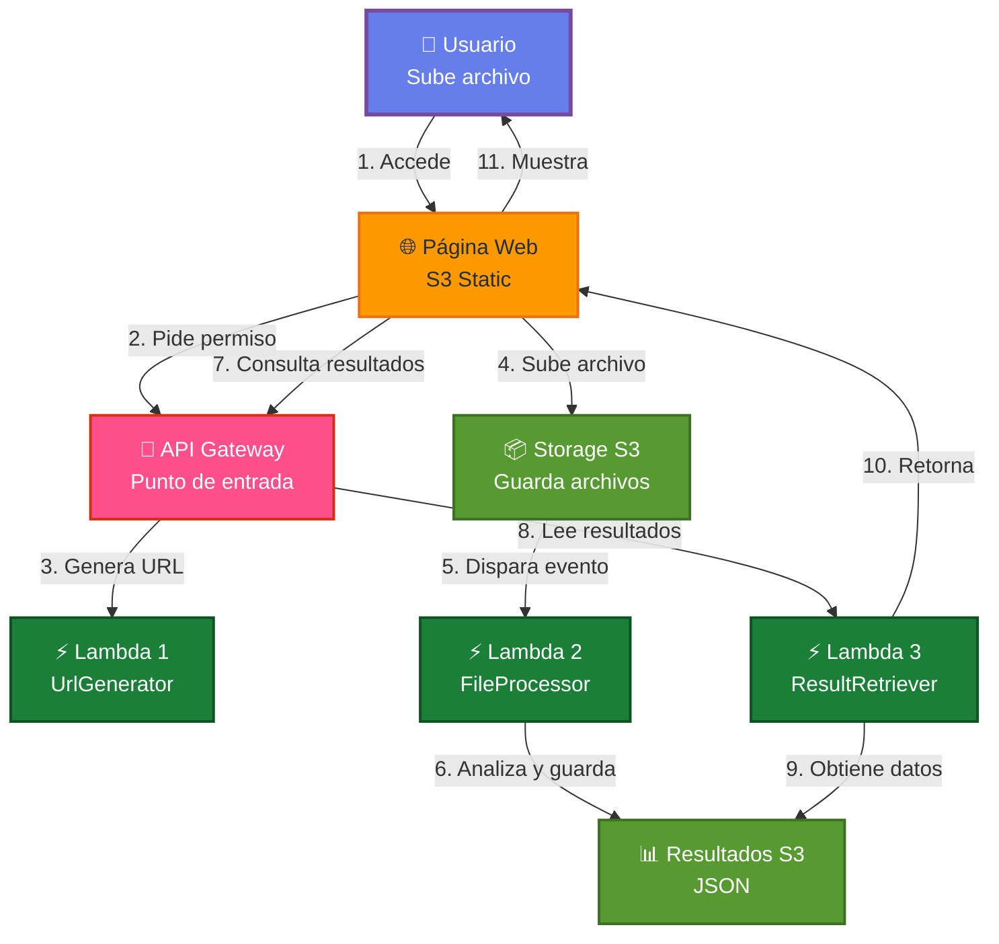

# AWS Analizer 


> **Aplicación serverless para análisis inteligente de documentos en AWS**

Proyecto de arquitectura cloud que implementa un sistema event-driven para procesamiento de archivos usando servicios nativos de AWS. Diseñado con principios de seguridad, escalabilidad y bajo acoplamiento.

---

## 📋 Tabla de Contenidos

- [Features](#-features)
- [Demo en Vivo](#-demo-en-vivo)
- [Arquitectura](#%EF%B8%8F-arquitectura)
- [Tech Stack](#tech-stack)
- [Empezar](#-empezar)
- [Deployment](#-deployment)
- [Documentación](#-documentación)
- [Decisiones de Diseño](#-decisiones-de-diseño)
- [Autor](#-autor)

---


## ✨ Features

### Core Functionality
- 📤 **Upload Seguro**: Presigned URLs para upload directo a S3 sin exponer credenciales
- ⚡ **Procesamiento Asíncrono**: Event-driven architecture con S3 triggers
- 📊 **Análisis Inteligente**: Extracción automática de metadata y generación de resúmenes
- 🎨 **UI Moderna**: Interfaz responsiva con drag & drop

### Arquitectura Cloud
- 🔒 **Seguridad por Diseño**: IAM con principio de menor privilegio
- 📈 **Escalabilidad Automática**: Serverless sin gestión de infraestructura
- 💰 **Costo-Efectivo**: Pay-per-use, ~$5/mes después de free tier
- 🌐 **CORS Configurado**: Support para múltiples orígenes

### Developer Experience
- 📝 **Logs Estructurados**: CloudWatch con trazabilidad completa
- 🧪 **Testeable**: Arquitectura desacoplada
- 📚 **Documentación Completa**: APIs, deployment y arquitectura
- 🔄 **CI/CD Ready**: Estructura preparada para automatización

---

## 🌐 Demo en Vivo

> **Frontend**: [http://your-bucket.s3-website-region.amazonaws.com](http://aws-analizer-andresrj18.s3-website-us-east-1.amazonaws.com/)

**Pruébalo**: Arrastra un archivo PDF, TXT, PNG o JPG (máx. 10MB) y observa el análisis en tiempo real.

### 🎥 Demo Video

[](https://youtu.be/4DVU6WhofvY)
---

## 🏗️ Arquitectura

### Diagrama Visual 

---

##  Tech Stack

### Frontend
- **HTML5** - Estructura semántica
- **CSS3** - Diseño moderno con CSS Variables
- **JavaScript (ES6+)** - State management y API consumption

### Backend AWS
- **AWS Lambda** - Compute serverless (Python 3.12)
- **Amazon S3** - Storage y static hosting
- **API Gateway** - REST endpoints con CORS
- **CloudWatch** - Logs y monitoreo
- **IAM** - Gestión de permisos

### Patrones Arquitectónicos
- Event-Driven Architecture
- Presigned URLs Pattern
- Polling Pattern
- Lambda Proxy Integration

---

## 🚀 Empezar

### Prerequisitos
```bash
# AWS CLI configurado
aws --version

# Python 3.12+
python3 --version

# Cuenta AWS con permisos para:
# - Lambda, S3, API Gateway, IAM, CloudWatch
```

### Instalación Local (Frontend)
```bash
# 1. Clonar repositorio
git clone https://github.com/tu-usuario/aws-analizer.git
cd aws-analizer

# 2. Configurar variables de entorno
cp frontend/config.example.js frontend/config.js
# Edita config.js con tu API Gateway URL

# 3. Servir frontend localmente
cd frontend
python3 -m http.server 8000

# 4. Abrir en navegador
open http://localhost:8000
```

### Configuración AWS

Ver documentación completa: [`docs/DEPLOYMENT.md`](docs/DEPLOYMENT.md)

**Resumen rápido**:
```bash
# 1. Crear S3 bucket
aws s3 mb s3://your-bucket-name

# 2. Desplegar Lambdas
cd backend/lambda/url_generator
zip -r function.zip lambda_function.py
aws lambda create-function \
  --function-name aws-analizer-url-generator \
  --runtime python3.12 \
  --handler lambda_function.lambda_handler \
  --zip-file fileb://function.zip \
  --role arn:aws:iam::ACCOUNT_ID:role/lambda-role

# 3. Configurar API Gateway
# Ver docs/DEPLOYMENT.md para pasos detallados
```

---

## 📦 Deployment

### Deployment Automático
```bash
# Próximamente: Script de deployment automatizado
./deploy.sh --environment production
```

### Deployment Manual

Consulta la guía completa: [`docs/DEPLOYMENT.md`](docs/DEPLOYMENT.md)

**Pasos principales**:
1. Crear recursos AWS (S3, Lambda, API Gateway)
2. Configurar IAM roles y policies
3. Configurar S3 triggers
4. Desplegar frontend en S3 Static Website
5. Configurar CORS

**Tiempo estimado**: 30-45 minutos

---

## 📚 Documentación

| Documento | Descripción |
|-----------|-------------|
| [ARCHITECTURE.md](docs/ARCHITECTURE.md) | Decisiones arquitectónicas y justificaciones técnicas |
| [DEPLOYMENT.md](docs/DEPLOYMENT.md) | Guía paso a paso para desplegar el proyecto |
| [API.md](docs/API.md) | Documentación de endpoints con ejemplos |

---

## 🎯 Decisiones de Diseño

### ¿Por qué Presigned URLs?

**Alternativa descartada**: Upload directo a Lambda
- ❌ Límite de payload (6MB)
- ❌ Mayor latencia
- ❌ Mayor costo

**Solución adoptada**: Presigned URLs
- ✅ Sin límite práctico de tamaño
- ✅ Upload directo del navegador a S3
- ✅ Menor costo (sin procesamiento Lambda)
- ✅ URLs temporales (expiración configurable)

### ¿Por qué Lambda Proxy Integration?

Permite a las Lambdas controlar completamente la respuesta HTTP (status codes, headers CORS), dando mayor flexibilidad que las transformaciones de API Gateway.

### ¿Por qué Event-Driven?

El procesamiento asíncrono con S3 Events desacopla el upload del análisis, permitiendo:
- Escalabilidad automática
- Retry automático
- Mejor UX (usuario no espera)

**Más detalles**: [`docs/ARCHITECTURE.md`](docs/ARCHITECTURE.md)

---

## 🗺️ Roadmap

### Versión Actual: 1.0.0
- [x] Upload con presigned URLs
- [x] Procesamiento asíncrono
- [x] Análisis de PDF, TXT, imágenes
- [x] Frontend responsivo
- [x] CORS configurado

### Próximas Features

#### v1.1.0 - AI Integration
- [ ] Integrar AWS Textract para extracción de texto de PDFs
- [ ] Usar AWS Rekognition para análisis de imágenes
- [ ] Amazon Bedrock para resúmenes con IA generativa

#### v1.2.0 - Advanced Features
- [ ] Autenticación con Cognito
- [ ] Dashboard de métricas con CloudWatch
- [ ] Rate limiting con API Gateway
- [ ] Notificaciones con SNS

#### v2.0.0 - Enterprise
- [ ] Multi-tenant architecture
- [ ] Batch processing
- [ ] Custom ML models con SageMaker
- [ ] Compliance (HIPAA, GDPR)

---

##  Autor

**Andrés Rodas**  
Informatics Engineering Student – UPCH  

☁️ Cloud Enthusiast  

- ✉︎ **LinkedIn:** [Andres Rodas](www.linkedin.com/in/andres-rodas-802309272)
- 📧 **Email:** andrescloud18sj@gmail.com
- 💼 **Portfolio:** [Mi Portafolio](https://andresrodas.vercel.app/)
  
## 📄 Licencia

MIT License


---

<p align="center">
  Hecho con ❤️ y ☕ usando AWS Serverless
</p>

<p align="center">
  <sub>Si este proyecto te ayudó, considera darle una ⭐</sub>
</p>
